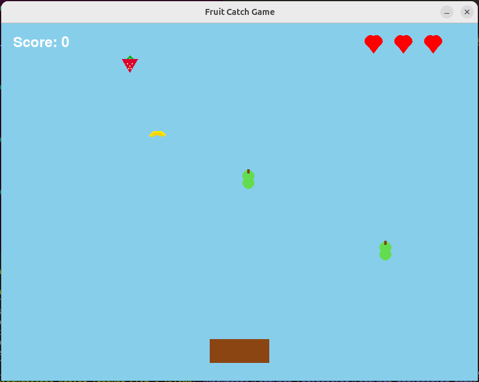

# Fruit Catch Game

## Introduction
The game is a simple arcade-style game where the player moves a basket to catch falling fruits while avoiding bombs.  
Every time the player catches a fruit the score goes up with one point.   
If the player catches a bomb, there follows an explosion and a heart is subtracted from the hearts.  
The player starts of with three hearts. If the player lost all his lifes, it is game over.  
The game features a pause menu with restart, continue, sound toggle, and score display.      

  

## Install/Run Instructions
Make sure you have **Python 3.12** or higher installed.  
Install required packages using pip:  

pip install -r requirements.txt

## Play Instructions
Use A / LEFT ARROW and D / RIGHT ARROW to move the basket.  
Press P to pause and open the pause menu.  
In the pause menu:  
    Restart → restart the game  
    Continue → return to the game  
    Sound On/Off → toggle background music  
    Score → shows current points  
Catch fruits to earn points and avoid bombs.  
You start with 3 lives; the game ends when all lives are lost.  

## Design
Built with Python and pygame.  
game.py contains the main game loop and pause menu.  
objects.py defines the FallingObject class and spawn logic.  
Pause menu buttons have hover effects and interactive sound toggle.  

## Authors
Rosanna Koning  
Romy Nguyen  
Bodiel Siebers  
Hajar Hosaini  
